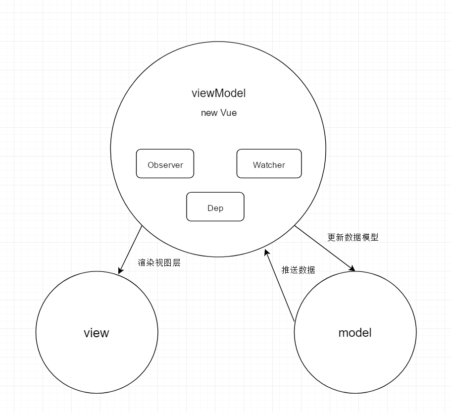

#文档分享 
### yulusheng52@qq.com(一起进步)
    gitlab: https://git.lug.ustc.edu.cn/yls666666/study
    码云：https://gitee.com/yulushen/vue_study
    github: https://github.com/Ylushen/studyVue
###一、目录结构
```
scripts                 # 与构建相关的脚本和配置文件
dist                    # 构建后的文件
flow                    # flow的类型声明               
packges                 # vue-server-renderer和vue-template-compiler,它们作为单独的NPM包发布
test                    # 所有的测试代码
src
    compiler            # 与模板编译相关的代码
    core                # 通用的，与平台无关的运行时代码（核心代码）
        observer        # 实现变化侦测的代码
        vdom            # 实现虚拟dom的代码
        instance        # Vue.js实例的构造函数和原型方法
        global-api      # 全局API的代码
        componments     # 通用的抽象组件
    server              # 特定平台代码
    platforms           # 单文件组件（*.vue文件）的解析逻辑
    sfc                 # 整个项目的公共工具代码
    shared              # typescript 类型定义
    types               # typescript 类型定义
        test            # 类型定义测试、
ylsTest                 # 个人仿照源码实现的小demo

参考：《深入浅出Vue.js》--刘博文
```

###二、实例化时进行的操作
1. 在生产环境中，在引入Vue的时候，core中实际执行的代码只有index.js中的代码，
仅仅是挂载了一部分的全局API方法，以及在Vue.prototype上的方法。创建一个抽象类挂载到全局window对象下。

2. 当我们视图实例化一个Vue类的时候，就会调用Vue.constructor方法（instance/index.js），
在Vue.constructor方法中，执行了this._init,this._init是挂载在原型上的方法
（instance/init）。

3. _init中执行的方法中，显示对传入的options进行处理。最终生成一个Vue实例。就如一个工厂流水线生产出来的产品。
传入的是一个空对象，空对象经过observer处理后就有了数据双向绑定的功能，将所有数据变化的视图层重新渲染都集中到_watcher.update方法处理。

4. 当所有数据属性都挂在到vm实例上后，就会调用原型上的$mount方法。$mount方法在代码中分了两
种形式。一种是带模板编译（vue,vue.min中都带有），一种是运行时编译（options中有render函数）。
带模板编辑的$mount方法，会调用core中的compiler模块，将模板编译成render方法，返回一个vnode
对象。

5. 然后调用_watcher属性上的_update(vm.render())方法，进行初次渲染，将render函数生成的vnode传入，
进行dom的操作。在运行时，如果数据产生了变化。重新调用_update时，参数render()会重新执行，
执行时this为vm对象，通过with(this)的方法，可以将this上的属性都以变量的形式使用。
（with是经过模板编译后，先生成一串字符串代码,字符串代码通过new Function(code)转换成可以执行的方法）

6. 至此，将生成的模板挂载到实际dom中，实例化完成。在之后每次数据模型进行更新，都会触发_watcher._update方法,
重新生成新的vnode，通过diff算法，对比出实际变化的dom，替换掉之后重新渲染到前端代码中。这就形成了类似MVVM的模式



###三、各个模块的概述
####1. observer
设计的各个类之间的关系图

```
入口： src/core/observer目录下的index.js文件的observe方法
```


