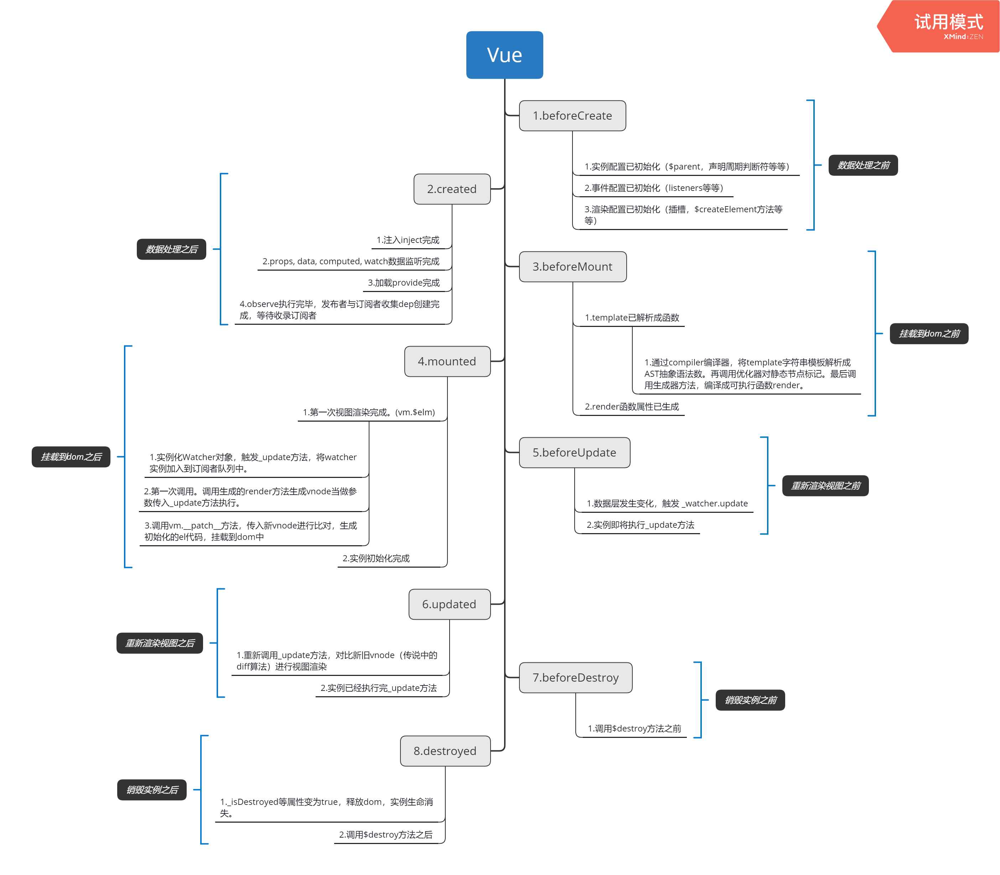
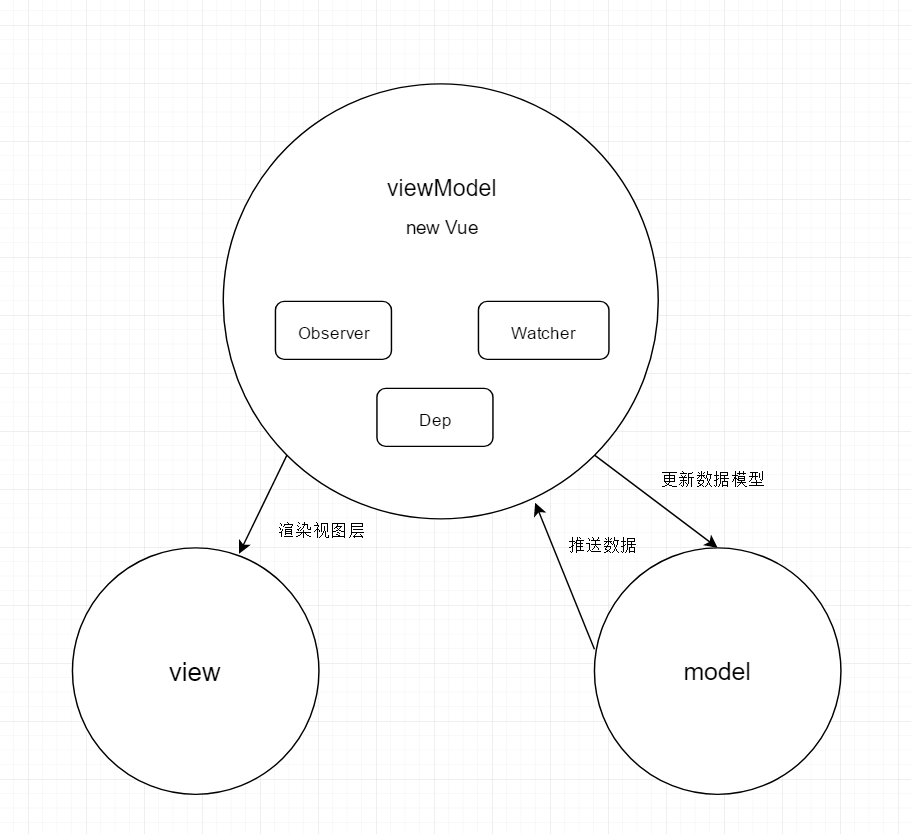
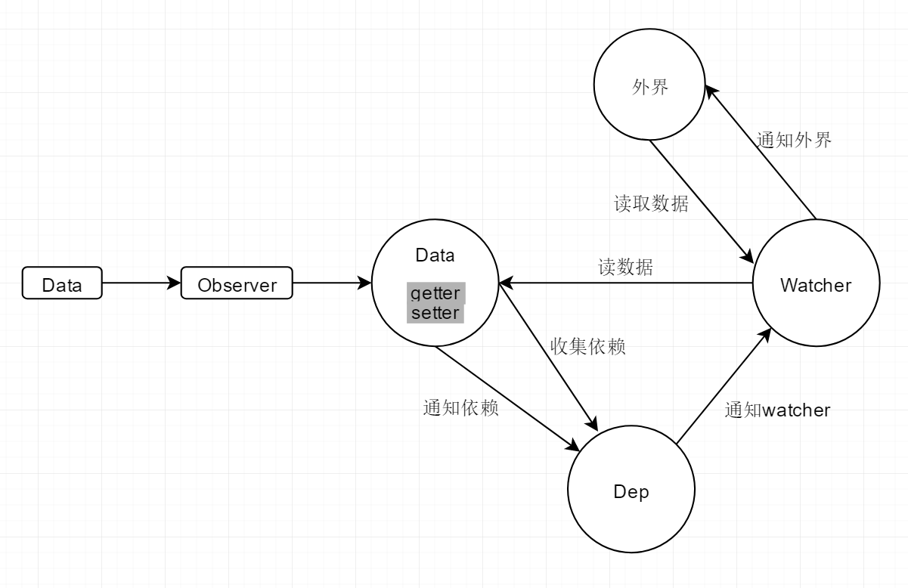

## 文档分享 
### yulusheng52@qq.com(一起进步)
    gitlab: https://git.lug.ustc.edu.cn/yls666666/study
    码云：https://gitee.com/yulushen/vue_study
    github: https://github.com/Ylushen/studyVue
    
    初次分享，理解不到位处必定不少，欢迎各位大佬指点。
### 一、目录结构
```
scripts                 # 与构建相关的脚本和配置文件
dist                    # 构建后的文件
flow                    # flow的类型声明               
packges                 # vue-server-renderer和vue-template-compiler,它们作为单独的NPM包发布
test                    # 所有的测试代码
src
    compiler            # 与模板编译相关的代码
    core                # 通用的，与平台无关的运行时代码（核心代码）
        observer        # 实现变化侦测的代码
        vdom            # 实现虚拟dom的代码
        instance        # Vue.js实例的构造函数和原型方法
        global-api      # 全局API的代码
        componments     # 通用的抽象组件
    server              # 特定平台代码
    platforms           # 单文件组件（*.vue文件）的解析逻辑
    sfc                 # 整个项目的公共工具代码
    shared              # typescript 类型定义
    types               # typescript 类型定义
        test            # 类型定义测试、
ylsTest                 # 个人仿照源码实现的小demo

参考：《深入浅出Vue.js》--刘博文
```
####实例生命周期详解


### 二、运行时进行的操作
1. 在生产环境中，在引入Vue的时候，core中实际执行的代码只有index.js中的代码，
仅仅是挂载了一部分的全局API方法，以及在Vue.prototype上的方法。创建一个抽象类Vue挂载到全局window对象下。

2. 当我们试图实例化一个Vue类的时候，就会调用Vue.constructor方法（instance/index.js），
在Vue.constructor方法中，执行了this._init,this._init是挂载在原型上的方法（instance/init）。
3. _init中执行的方法中，先是对传入的options进行处理。最终生成一个Vue实例。就如一个工厂流水线生产出来的产品。
传入的是一个空对象，空对象经过observer处理后就有了数据双向绑定的功能，将所有数据变化的视图层重新渲染都集中到_watcher.update方法处理。
4. 当所有数据属性都挂载到vm实例上后，就会调用原型上的$mount方法。$mount方法在代码中分了两种形式。
一种是带模板编译模块（vue,vue.min中都带有），一种是运行时直接执行（options中有render函数）。
带模板编辑的$mount方法，会载入core中的compiler模块，先将模板编译成可执行的render方法，挂载在vm.$options.render属性上。
5. 然后调用_watcher属性上的`update()`方法，调用实例上的`vm._update(vm._render(), hydrating)`进行初次渲染，将render函数生成的vnode传入，
进行dom的操作。在运行时，如果数据产生了变化。重新调用update时，参数`render()`会重新执行，
执行时this为vm对象，通过with(this)的方法，可以将this上的属性都以变量的形式使用。
（with是经过模板编译后，先生成一串字符串代码,字符串代码通过new Function(code)转换成可以执行的方法）
6. 至此，将生成的模板挂载到实际dom中，实例化完成。在之后每次数据模型进行更新，都会触发_watcher.update方法,
重新生成新的vnode，通过diff算法，对比出实际变化的dom，替换掉之后重新渲染到前端代码中。这就形成了类似MVVM的模式



### 三、各个模块的概述
#### 1. observer
设计的各个类之间的关系图

**入口： src/core/observer/index.js中的observer方法**<br>
1. 使用了发布者(Observer)订阅者(Watcher)模式,Dep收集订阅者，并且通过Dep通知订阅者。
Observer的原理，vue2.0版本中，利用了js的`Object.defineProperty()`方法。
    ```javascript
    // 大概类似于这种
    let val = '';
    Object.defineProperty(data, key, {
      enumerable: true,
      configurable: true,
      get() {
        // todo1... 在获取属性值前触发的操作
        return val;
      },
      set(value) {
        val = value;
        // todo2... 在设置属性值后触发的操作
      }
    });
    ```
   
2. 通过以上的方法，可以实现当我们在操作data中的某一个属性值时，无论是设置还是获取，都能触发一部分代码。
这部分代码，就可以让我们实现数据变化的侦听了。
3. 现在，我们有了对数据侦听的能力。接下来，我们就可以通过遍历vm.data，将所有的属性都通过以上的方式，
进行代理。至此，对象上任何一个属性都已经可以触发我们自己想要进行的操作代码了。
4. 能够知道什么时候需要通知后，我们现在就需要收集信息的订阅者，收集，就涉及到保存和通知。首先，
保存功能因为需要能保存多个数据，所以可以使用数组来收集，为每一个key创建一个数组，这个是一个私有属性，
使用闭包的特性来创建一个作用域数组变量。如下：
    ```javascript
    /**
     * @param data 需要进行侦听的对象
     * @param key 侦听的属性key
     * @param val 保存当前属性的值
     */
    function def(data, key, val) {
      // 订阅者队列，当前的key对应的
      const dep = [];
      Object.defineProperty(data, key, {
        enumerable: true,
        configurable: true,
        get() {
          // 在此添加一步操作，将订阅者添加进队列
          if (dep.indexOf(watcher)) dep.push(watcher);
          return val;
        },
        set(value) {
          val = value;
          // 赋值后，再通知订阅者重新拉取数据。
          dep.forEach(item => item._update())
        }
      });
    }
    ```
5. 通过以上的方法，将对象属性递归遍历处理一次，获得能够储存订阅者的数组的模型，数组从变化到通知,
都在这个模块中消化了，入口是当前实例需要侦听的数据模型，以及当前实例。出口，就是对变化的数据侦听了的订阅者。
vue的侦听原理大概就是这样的模型。get代理收集订阅，set代理通知订阅，达到同步刷新数据跟视图的目的   
6. 当然，还漏了点东西。前面只是实现了对Object对象的属性侦听。但实际上，数据模型不仅仅只有对象，
还会有数组。数组操作一般都是通过各种方法去进行元素操作的。所以用对象的侦听方式去侦听数组，是无效的。
现在有两种数据操作模式。比如有个变量arr=[1]，给他赋值一个新数组，arr=[2],这种方式可以通过属性变化来监听，
但是，如果使用arr.push(2)，这种方式就侦听不到了。所以需要来特殊处理一下。
7. 关于数组的处理方式，可以借用function.apply的属性方法，来操作。如下代码：
    ```javascript
   // 以push方法为例,先创建一个新对象，
   const arrayMethods = {};
   // 对这个对象的push属性进行代理
   Object.defineProperty(arrayMethods, 'push', {
     enumerable: true,
     configurable: true,
     get(...args) {
       // todo... 此处可以进行我们需要的代理操作
       return Array.prototype.push.apply(this, args)
     }
   });
   // 将数据中的数组原型代理成新对象
   if (Array.isArray(val)) val.prototype = arrayMethods

    ```
8. 通过以上的方法，就找到了对数组的方法进行侦听的办法。在vue源码中，就是通过这种方式，去代理数组的操作方法的。
实际上，需要代理的只是数组属性中对元素位置和数量操作的方法，那么列出来的话，只有七种符合要求：push, shift, unshift,
pop, sort, splice, 'reverse'。正因为如此,vue才会有一个数组操作过程中，饱受诟病的问题。如果通过arr[0] = 2这种操作去赋值的话。
是不会触发数据渲染方法的，所以也不会有视图同步更新。vue在这方面，提供了一个Vue.prototype.$set方法，去设置数组的值，并且触发更新。
9. 以上就是vue的数据侦听原理。当然，实际原理中的代码不会只有这么简单，比如，源码中的dep并不是一个数组，而是一个Dep类，
它有自己的调用方法，而且添加dep不会使用数组的查重方式，而是将收集订阅的方法放入了Watcher中，通过每一个Watcher有一个保存dep实例的id的map,
因为对象查重比数组要方便有效的多，能节约性能。这些小细节都是必须深入到源码中，才能理解得到其中的奥秘的。
    ```typescript
    class Watcher {
       // 源码中，get方法里，调用dep.push(watcher),实际执行的是这段代码
       // this指向的Watcher实例
      addDep (dep: Dep) {
          const id = dep.id;
         // newDepIds是存储dep实例id的map。
          if (!this.newDepIds.has(id)) {
           this.newDepIds.add(id);
           this.newDeps.push(dep);
           if (!this.depIds.has(id)) {
             dep.addSub(this)
           }
          }
      }
    }
    ```
**以上就是对vue源码中数据侦听源码(core/observer)的一个大致的分享。**

#### 2. patch 
**入口：vdom/patch.js**<br>
1. patch方法是在实例重新渲染页面dom的时候，将实例的vnode转换成对应的dom时调用的方法__patch__。作用是当数据侦听调用update方法时，
通过将新旧vnode的对比，尽可能减少实际dom的操作，尽量复用旧的dom元素组合成新的dom树，返回给实例去加载到html文档中。

2. 为什么要有虚拟dom？因为在前端操作中，dom的操作其实是调用的浏览器给的api,dom属于宿主对象，在js原本的语言对象中，是不存在dom对象的，
所以js如果想操作dom,只能通过调用浏览器给的一些列dom操作api才能操作。正因如此，当我们操作dom时，性能远远不如我们执行的js基本对象的。
然而，实际业务场景中，dom的操作又经常时大量且重复的。这就导致了在不断的创建，销毁，更新dom中，浏览器会浪费很多不必要的性能。所以，
因为重复，所以我们可以尽量复用已经创建好的dom，减少销毁和重新构建的性能开支。这样就能提高一部分提高效率。
3. 因为想要复用创建好的dom,所以我们免不了要去进行不同dom之间的对比，但是，去操作实际dom对比时，也会调用大量的浏览器api，这又会增加性能开支，
所以，在vue中，就有了虚拟dom，也就时vnode，通过使用vnode的方式，模拟dom中的node类型，将原本的dom对象，映射成js中基本对象类型构建的vdom，
这样，我们通过对比原生js对象，避免了对比时调用大量的浏览器api，又节约了一部分浏览器性能损失。
4. 但是这样，还是不够，按我们原本的对比方法，对比dom树时，通过双重循环去调用，那么这样的时间复杂度，就跟节点数量多少有了很大的出入了，O(n^2)，
随着项目的增加，这样重复的对比也会又大量的性能损失，所以在vue中。又出现了diff算法对比。
5. diff算法：就是在对比过程中，通过一系列的优化操作，**尽可能的通过更少的比较次数复用更多的dom节点**。比如：
    1. tree diff: 因为在实际开发中，节点跨层级复用的几率很小，所以diff算法，在对比中，会跳过对新旧树节点中跨层级节点的比较
    
    2. component diff: 因为在开发中，不仅仅有浏览器dom,也可能设计到组件的比对，这也是有优化项的。在对比中，如果新组件与就组件的类型相同，
    则会复用组件下的子集dom,只更新当前组件的属性
    3. element diff: 当节点对应的类型，为原生dom类型时。就会进行更细粒度化的比较。具体的比较规则为：<br>
    `1. 从list两头往中间比较，比较成功，就将旧vdom的elm属性赋值给新vdom，新旧比较位置往中间挪动一位。当新旧前位置下标大于对应后位置下标时，退出对比。`<br>
    `2. 比较时，分四步顺序比较，新前->旧前，新后->旧后，新前->旧后，新后->旧前。新key in keysMap？再没有，就直接重新渲染当前新节点，并往前挪一位`
    4. 正因为以上的比较方式，当子节点列表过长且节点类型过多时，如果不给节点配置key，那么复用节点比例会随着list的增加而大大减少。以至于又会出现大量重复的渲染。
    导致性能的损失，所以vue文档中建议，当使用for循环时，尽可能的给list设置对应的key，因为vue会为当前自节点列表配置一个key的map对象。当四种基本对比方法失效时，
    会获取当前的元素的key，去旧keyMap中查找相同key节点。map[key]的方式，时间复杂度为O1，所以能解决当节点过多时，复用率过低的问题。
    5. 以上就是diff算法，在vue源码中，解决因dom操作过多而导致渲染效率低问题的方法。
    6. 两个list比较的diff算法过程代码实现：
        ```javascript
       // 模拟的diff算法
       // 声明新旧开始与结尾节点的下标和元素
       let oldStartIndex = 0;
       let newStartIndex = 0;
       let oldEndIndex = oldList.length - 1;
       let newEndIndex = newList.length - 1;
       let oldStartNode = oldList[oldStartIndex];
       let newStartNode = newList[newStartIndex];
       let newEndNode = newList[newEndIndex];
       let oldEndNode = oldList[oldEndIndex];
       let keyMap; // 旧key的map集合
       // 新旧vnode对比方法
       const someVnode = (oldVnode, newVnode) => {
           // 先对比key是否相同，如果key不同，直接放弃比较(key都为空时，条件也成立)
           // 再对比name是否相同，如果两者都相同，则返回对比成功。
           return newVnode.key === oldVnode.key && newVnode.name === oldVnode.name;
       };
       // 模拟的diff算法
       while (newStartIndex <= newEndIndex && oldStartIndex <= oldEndIndex) {
           // 对旧节点进行判空操作
           if (oldStartNode === void 0) oldStartNode = oldList[++oldStartIndex];
           else if (oldEndNode === void 0) oldEndNode = oldList[--oldEndIndex];
           else if (someVnode(oldStartNode, newStartNode)) {// 新前->旧前
               newStartNode.value = oldStartNode.value;
               newStartNode = newList[++newStartIndex];
               oldStartNode = oldList[++oldStartIndex];
           } else if (someVnode(oldEndNode, newEndNode)) {// 新后->旧后
               newEndNode.value = oldEndNode.value;
               newEndNode = newList[--newEndIndex];
               oldEndNode = oldList[--oldEndIndex];
           } else if (someVnode(oldEndNode, newStartNode)) {// 新前->旧后
               newStartNode.value = oldEndNode.value;
               newStartNode = newList[++newStartIndex];
               oldEndNode = oldList[--oldEndIndex];
           } else if (someVnode(oldStartNode, newEndNode)) {// 新后->旧前
               newEndNode.value = oldStartNode.value;
               newEndNode = newList[--newEndIndex];
               oldStartNode = oldList[--oldStartIndex];
           } else {
               // 生成旧dom的keyMap
               if (!keyMap) {
                 keyMap = {};
                 oldList.forEach(item => {
                   if (item.key) keyMap[item.key] = item.value;
                 });
               }
               // 如果key相同，就认为是同一节点，复用
               if (keyMap[newStartNode.key] !== void 0) newStartNode.value = keyMap[newStartNode.key];
               newStartNode = newList[++newStartIndex];
             }
           }
        ```
    7. 比较两个简单的list
        ```javascript
        let newList = [
            {name: 'div'}, //下标0
            {name: 'div'}, //下标1
            {name: 'h1'},  //下标2
            {name: 'div'}, //下标3
            {name: 'h1'},  //下标4
        ], oldList = [
            {name: 'h1', value: 3},  //下标0
            {name: 'div', value: 1}, //下标1
            {name: 'div', value: 2}];//下标2
       // 输出结果
       // [
       //   {name: 'div', value: 2},
       //   {name: 'div', value: 1},
       //   {name: 'h1', value: 3},
       //   {name: 'div'},
       //   {name: 'h1'},
       // ]
        ```
    8. 比较多类型list
        ```javascript
        // 多类型list
        let newList = [
            {name: 'div'},
            {name: 'div'},
            {name: 'h2'},
            {name: 'div'},
            {name: 'h1'},
        ], oldList = [
            {name: 'h5', value: 3},  //下标0
            {name: 'h2', value: 1}, //下标1
            {name: 'div', value: 4}, //下标1
            {name: 'div', value: 5}, //下标1
            {name: 'h1', value: 6}, //下标1
            {name: 'div', value: 7}, //下标1
            {name: 'h6', value: 2}];//下标2
       // 输出结果
       // [
       //   {name: 'div'},
       //   {name: 'div'},
       //   {name: 'h2'},
       //   {name: 'div'},
       //   {name: 'h1'},
       // ]
        ```
    9. 比较多类型带key的list
        ```javascript
        // 带key的多类型list
        let newList = [
          {name: 'div', key: 'key1'},
          {name: 'div', key: 'key2'},
          {name: 'h2', key: 'key3'},
          {name: 'div', key: 'key4'},
          {name: 'h1', key: 'key5'},
        ];
        let oldList = [
          {name: 'h5', value: 3},
          {name: 'h2', value: 1, key: 'key3'},
          {name: 'div', value: 4, key: 'key1'},
          {name: 'div', value: 5, key: 'key2'},
          {name: 'h1', value: 6, key: 'key5'},
          {name: 'div', value: 7, key: 'key4'},
          {name: 'h6', value: 2}];
       // 输出结果
       // [
       //   {name: 'div', key: 'key1', value: 4},
       //   {name: 'div', key: 'key2', value: 5},
       //   {name: 'h2', key: 'key3', value: 1},
       //   {name: 'div', key: 'key4', value: 7},
       //   {name: 'h1', key: 'key5', value: 6},
       // ]   
        ```
6. 具体的代码demo我放在了**ylsTest/Patch/index.js**文件中。当然，vue源码中还有很多注重细节的地方，
但是实现原理大致相同。在开发中，当我们使用v-if过多时，也可以尝试给每个节点添加唯一的key来优化渲染速度。       

#### 3. compiler
**入口：compiler/index.js** <br>
1. 本模块在vue中的作用，是将vue语法写成的字符串，通过该模块的转换，最终输出一个render函数。每个实例都有一个render,
render的作用就是在调用实例的`_watcher.update()`方法时，生成新的vnode传入方法中，进行视图层的更新。
所以，本模块的最终的目的，就是生成vnode传给vm实例使用。

2. 所以，在`new Vue(options)`时，如果配置项不传入render函数，那么，$mount方法就会调用本模块，将el传入的字符串，
或者el标签的内容innerHtml，当成参数template传入本模块，调用core/compiler/index的createCompiler方法，
将传入的字符串，先通过解析器parse转换成抽象语法树，在通过优化器optimize标记一些静态属性与根节点，然后通过代码生成器generate，
生成render字符串代码。
3. 其中的核心代码为解析器，解析器的工作流程，跟浏览器解析html文档的流程相仿，先在parse作用域下，
创建一个stack执行栈，用来存放解析的tag节点。再创建start,end,common,chars四个方法，四个方法都创建在当前作用域下，
然后再通过参数方式传入parseHTML，在执行过程中，通过正则匹配的方式，对<tag/>,<tag><tag/>,<-- common -->,chars等节点进行匹配，
通过 < 符号区分，可以将匹配到的字段分成开始标签，结束标签，注释节点，文本节点，在匹配到时，分别调用对应的四个方法。如：
   ```
   start：会将当前tag压入栈中。
   end：弹出栈中第一个与tag名称相同的元素，并且将其加入到当前栈顶元素的children属性中。
   通过栈的方式，可以保证当前栈中的上一个元素，必定是当前元素的父元素，保证了树图的构成
   ```
4. 具体的解析，在parseHTML中，是通过一个`while(html)`进行操作，有一个公共的切割方法advance方法，会根据当前匹配到的字符下标，
将该字符从html字符串中切割掉。然后根据匹配到的tag类型调用不同的方法，直到html被切割完，或者，执行完一次循环后，html字符串没有变化，
则停止循环。如果是后者停止，则会抛出模板错误，停止代码运行。
5. 通过该种方式，将一串vue代码模板，解析成了AST抽象语法树。然后将再调用优化器optimize，将抽象语法树中，没有参数的文本节点，
以及没有特殊属性的tag节点，标记为静态属性，添加static属性，表示该节点不需要进行额外对比，可以复用。
6. 最后，通过生成器generate处理后，生成了字符串代码。比如:
    ```
   字符串代码: _c('div',{attrs:{"id":"app"}},[_v("\n  "+_s(aaa)+"\n")])
   可以通过render = new Function(with(this){return _c('div',{attrs:{"id":"app"}},[_v("\n  "+_s(aaa)+"\n")])})
   ```
7. 将该段解析的代码，解析成可执行的代码，这其中的关键，在于with(this)，通过这种方式，可以将this的属性，直接不用加前缀的调用。
这样，就可以直接拉区vm实例上对应的属性，渲染成静态的新的vnode，然后再传给_update当作参数使用。
8. 模板编译一般只会调用一次，实例化时调用。如果是使用的vue-cli开发工具开发，那么.vue文件都会被预编译成render函数，打包成纯js代码，
可以减少运行时渲染时间。也支持引入vue.runtime.js代码，这个形态的代码，去除了compiler这个模块的内容，可以使得js的包减少大约1/3，
使得前端拉取代码时减少不必要的加载时间，更快的渲染出视图。
